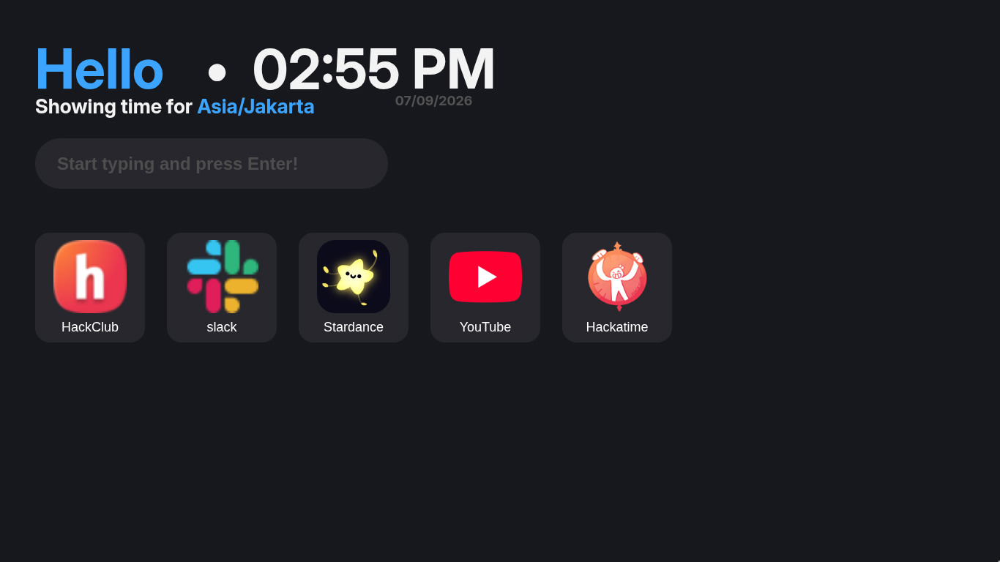

# Perfect Start ⭐

A perfect start screen for your browser with (planned) customizability and freedom!
<br>
[Check it out!](https://perfect-start.vercel.app)

---


_Please note that this Demo Screenshot is NOT the final product._

---

## Features

- [x] Datetime features
- [x] Live-clock
- [x] Shortcuts button (PARTIALLY DONE)
- [x] Searchbar (PARTIALLY DONE)
- [ ] Customization/Settings Button
- [ ] More Widgets (Upcoming!)
- [ ] Web Responsive Design

## How to run locally

### Prerequisites

- NodeJS: `v20.19.0` or higher
- Git: For version control

### Steps

1. Clone the Repository:

```bash
git clone https://github.com/dumpiez/perfect-start
cd perfect-start
```

2. Install the dependencies:

```bash
npm install
```

### Running the Application

Start the local development server using:

```bash
npm run dev
```

Once the server starts, head to your browser and navigate to **https://localhost:5173** or any other local URL displayed in your terminal.

## Credits and Acknowledgements

1. [favicon.im API](https://favicon.im/api)
2. [React Docs](https://https://react.dev/)
3. [HackClub ❤️](https://hackclub.com)
